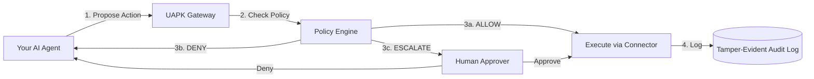

# Enterprise Solutions

UAPK Gateway provides **enterprise-grade AI agent governance** for organizations deploying autonomous AI in **high-stakes environments**.

---

## Why UAPK Gateway?

- **Built for Regulated Industries**

Designed for law firms, banks, fintechs, and compliance teams where mistakes have legal consequences

- **Evidence-Grade Audit Trails**

Tamper-evident logs with hash chaining and cryptographic signatures that survive legal scrutiny

- **Non-Bypassable Enforcement**

Agents propose actions, gateway enforces policy. Tools run with gateway credentials, not agent credentials.

- **Fast Deployment**

Production-ready in 2-4 weeks with our pilot program. Self-hosted on your infrastructure.

---

## Real-World Use Cases (47ers)

We've built pre-configured templates ("47ers") for common high-stakes workflows. Each is a production-ready UAPK Manifest that runs on the gateway.

### Legal

#### Settlement Negotiation Gate
**Use case:** AI agent negotiating IP settlements

**Guardrails:**
- Max settlement amount ($50K without approval)
- Counterparty verification required
- Jurisdiction constraints (US only)
- Human approval for amounts >$50K

**Why:** Prevents unauthorized settlements, ensures legal review for high-value cases

[View Template →](https://github.com/UAPK/gateway/tree/main/examples/47ers/legal/ip_enforcement_settlement_gate.json)

#### Takedown Notice Gate
**Use case:** AI agent issuing DMCA takedowns

**Guardrails:**
- Legal review required for first-time targets
- Rate limits (max 10/day)
- Evidence attachment required
- Approval for sensitive platforms (Twitter, YouTube)

**Why:** Prevents abuse, ensures legal compliance, protects brand reputation

[View Template →](https://github.com/UAPK/gateway/tree/main/examples/47ers/legal/takedown_notice_gate.json)

---

### Finance

#### Trading Execution Gate
**Use case:** AI agent executing trades

**Guardrails:**
- Max trade size ($10K per transaction)
- Daily budget limit ($100K)
- Market hours only (9:30 AM - 4:00 PM ET)
- Human approval for >$10K trades

**Why:** Prevents runaway trading, ensures risk management, regulatory compliance

[View Template →](https://github.com/UAPK/gateway/tree/main/examples/47ers/finance/trading_execution_gate.json)

#### KYC Onboarding Agent
**Use case:** AI agent onboarding customers

**Guardrails:**
- ID verification required
- Sanctions list check (OFAC)
- Human review for high-risk jurisdictions
- Audit log for regulatory reporting

**Why:** AML/KYC compliance, reduces fraud, ensures regulatory reporting

*Template coming soon*

---

### Compliance

#### Vendor Due Diligence Gate
**Use case:** AI agent vetting vendors

**Guardrails:**
- Credit check required (Dun & Bradstreet)
- Sanctions screening (OFAC, EU)
- Human approval for contracts >$25K
- Annual re-verification

**Why:** Third-party risk management, compliance, procurement controls

[View Template →](https://github.com/UAPK/gateway/tree/main/examples/47ers/compliance/vendor_due_diligence_gate.json)

#### KYC Onboarding Gate
**Use case:** Customer onboarding automation

**Guardrails:**
- Identity verification (Plaid, Onfido)
- Sanctions screening
- Risk scoring with escalation
- Regulatory reporting

**Why:** AML/BSA compliance, fraud prevention, audit trails

[View Template →](https://github.com/UAPK/gateway/tree/main/examples/47ers/compliance/kyc_onboarding_gate.json)

---

### General Purpose

#### Outbound Email Guard
**Use case:** AI agent sending customer emails

**Guardrails:**
- Recipient allowlist (existing customers only)
- Rate limits (max 100/day)
- Content policy (no PII, no financials)
- Human review for new recipients

**Why:** Prevents spam, protects customer relationships, GDPR compliance

[View Template →](https://github.com/UAPK/gateway/tree/main/examples/47ers/general/outbound_email_guard.json)

---

## See All 47ers

Browse the complete library of pre-built templates:

[View 47ers Library →](/docs/47ers/)

---

## How It Works

**Key principle:** Agents don't have direct access to tools. They propose actions to the gateway, which enforces policy and logs everything.

---

## Engagement Options

### Open Source
**Free (Apache-2.0)**

Self-host UAPK Gateway on your infrastructure

- All core features included
- Community support via GitHub
- Full control over deployment
- No vendor lock-in

[Get Started →](/docs/quickstart/)

### Pilot Program
**$15,000 - $25,000**

Deploy one workflow in 2-4 weeks with expert help

- Production-ready manifest + guardrails
- Integrated agents + approval flows
- Evidence-grade audit logs
- Operator training + runbooks

[Learn More →](/docs/business/pilot/)

### Enterprise Support
**$3K - $10K/month**

Ongoing support for production deployments

- Custom connectors (Salesforce, M365)
- SLA (4-hour response, 99.9% uptime)
- Security patches + upgrades
- Priority feature requests

[Contact Us →](mailto:mail@uapk.info)

---

## Customer Success Stories

> **Law Firm Partner**
>
> "We needed a way to let our AI negotiate settlements without creating liability risk. UAPK Gateway's approval workflows and audit logs gave us the confidence to deploy. The pilot paid for itself in the first month."
>
> — *Managing Partner, IP Litigation Boutique*

> **Fintech CTO**
>
> "Compliance blocked our agent deployment for months. UAPK Gateway's tamper-evident logs and policy enforcement got us to production in 3 weeks. The audit trail was exactly what regulators wanted to see."
>
> — *CTO, Series B Fintech*

> **Compliance Director**
>
> "We can finally say 'yes' to AI agent proposals. The budget controls, approval workflows, and evidence-grade logs mean we're not sacrificing governance for innovation."
>
> — *Director of Compliance, Regional Bank*

---

## Security & Compliance

UAPK Gateway is designed for regulated environments:

- **Encryption**

Secrets encrypted at rest (Fernet), TLS in transit, Ed25519 signatures

- **Tamper-Evident Logs**

Hash-chained interaction records with cryptographic verification

- **Compliance-Ready**

SOC 2 readiness: evidence pack + control mapping available. SOC 2 audit timeline: on request. GDPR-ready (self-hosted), audit export bundles.

- **Access Controls**

JWT auth, API keys with scopes, RBAC, capability tokens

[View Security Details →](/docs/security/)

---

## Getting Started

- **1. Explore**

Browse the [47ers Library](/docs/47ers/) to see pre-built templates for your industry

- **2. Self-Host**

Follow the [Quickstart Guide](/docs/quickstart/) to deploy the open-source version

- **3. Pilot**

Contact us for a [Pilot Program](/docs/business/pilot/) to deploy one workflow in 2-4 weeks

- **4. Scale**

Transition to [Enterprise Support](/docs/business/pricing/#4-enterprise-support) for production

---

## Why Choose UAPK Gateway?

### Model-Agnostic & Vendor-Agnostic
- Works with any agent framework (LangChain, AutoGPT, custom)
- Not tied to OpenAI, Anthropic, or any specific model vendor
- **You own the evidence** (not stored in vendor logs)

### Self-Hosted
- Deploy on your infrastructure (one VM, Docker Compose)
- No data leaves your environment
- GDPR compliance through data residency
- No vendor lock-in

### Production-Ready
- Used in production by law firms, fintechs, and compliance teams
- Battle-tested policy engine
- Comprehensive documentation and examples
- Active development and support

---

## Related

[Pricing](/docs/business/pricing/)
[Pilot Program](/docs/business/pilot/)
[Support](/docs/business/support/)
[47ers Library](/docs/47ers/)

---

**Contact:** [mail@uapk.info](mailto:mail@uapk.info)
**Response time:** 24 hours for commercial inquiries
