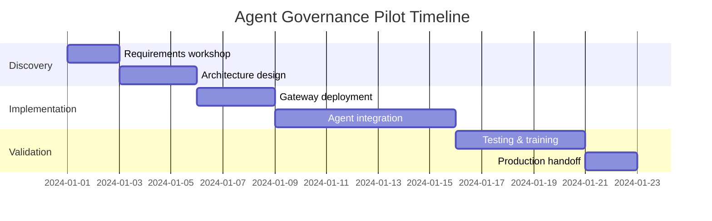

import ContactForm from '@site/src/components/ContactForm';

# Agent Governance Pilot

Get from **"compliance won't sign off"** to **"deployed in production"** in 2-4 weeks.

**Fixed-fee pilot:** €15,000–€25,000
**Duration:** 2-4 weeks from kickoff

---

## What You Get

We implement UAPK Gateway for **one high-value workflow** and deliver a production-ready deployment with all the governance, approvals, and audit trails you need.

### Deliverables

#### Production Manifest
UAPK Manifest defining agent boundaries, policies, budgets, and escalation rules

#### Deployed Gateway
Running UAPK Gateway instance on your infrastructure (self-hosted VM or cloud)

#### Integrated Agents
Your agent(s) connected via API, calling `/v1/gateway/evaluate` and `/execute`

#### Approval Workflows
Human-in-the-loop approvals configured for high-risk actions (web UI + API)

#### Evidence-Grade Logs
Tamper-evident interaction records with verified chain integrity

#### Compliance Bundle
Sample audit log export formatted for regulators and auditors

#### Operator Training
2-hour training session for your operators (approve/deny, export logs, verify chain)

#### Documentation
Runbooks, troubleshooting guides, and production deployment checklist

---

## 3-Phase Approach

### Phase 1: Discovery & Design (Week 1)

**Activities:**
- Requirements workshop (2-3 hours)
- Map agent roles, actions, and tools
- Define policy rules and escalation thresholds
- Design approval workflows
- Document compliance requirements (SOC2, GDPR, internal audit)

**Deliverables:**
- UAPK Manifest (draft)
- Integration architecture document
- Success criteria and acceptance tests

---

### Phase 2: Implementation (Week 2-3)

**Activities:**
- Deploy UAPK Gateway to your infrastructure
- Configure authentication (JWT + API keys)
- Integrate target agent(s) via API or SDK
- Implement connectors (HTTP, webhook, custom tools)
- Configure approval workflows (web UI + API)
- Set up tamper-evident logging with hash chaining
- Deploy to staging environment

**Deliverables:**
- Running UAPK Gateway instance (staging)
- Integrated agent(s)
- Active UAPK Manifest
- Approval workflow (UI + API)
- Interaction logs with verified chain

---

### Phase 3: Validation & Handoff (Week 3-4)

**Activities:**
- End-to-end testing (happy path + edge cases)
- Security review (secrets, API keys, connector allowlists)
- Performance validation (latency, throughput)
- Operator training (2-hour session)
- Documentation review
- Production deployment planning

**Deliverables:**
- Test results and performance benchmarks
- Compliance export bundle
- Operator runbook
- Production deployment checklist
- 30 days post-pilot bug fixes

---

## Success Criteria

Pilot is considered successful when:

- Target agent(s) integrated and calling gateway APIs
- UAPK Manifest active with policy enforcement (ALLOW/DENY/ESCALATE)
- Approval workflow tested and operational
- Tamper-evident logs verified (chain integrity check passes)
- Compliance export bundle generated and reviewed
- Operators trained and able to manage approvals
- Production deployment plan approved

---

## What We Need From You

#### Access
To your target AI agent(s) and integration endpoints

#### Infrastructure
1 VM (2 vCPU, 4GB RAM) + PostgreSQL for UAPK Gateway deployment

#### Subject Matter Experts
2-4 hours/week for requirements and testing

#### Stakeholders
Approval workflow owners for training and UAT

---

## Pricing & Payment

**Fixed Fee:** €15,000–€25,000 (based on complexity and agent count)

**Payment Schedule:**
- 50% upon SOW signature (project kickoff)
- 50% upon successful completion and acceptance

**What's Included:**
- All deliverables listed above
- Dedicated solutions engineer
- Weekly sync calls (30-60 minutes)
- Operator training (2-hour session)
- 30 days post-pilot bug fixes

**Not Included (optional add-ons):**
- Custom connectors beyond HTTP/webhook (priced separately)
- Extended training (beyond 2 hours)
- Ongoing support after 30-day period (see [Enterprise Support](/docs/business/pricing/#4-enterprise-support))
- Compliance consulting (e.g., SOC2 audit prep)

---

## Timeline



**Typical timeline:** 2-4 weeks from kickoff to production-ready

---

## Typical Pilot Scope

#### Agents
1-3 AI agents

#### Workflows
1-2 approval workflows

#### Integrations
1 integration (e.g., Slack notification)

#### Operators
2-4 trained operators

**Additional agents or workflows beyond this scope may require a change order.*

---

## Post-Pilot Options

### Option 1: Self-Managed (Open Source)
Continue with the self-hosted deployment independently:
- Apache-2.0 license (fully open)
- Community support via GitHub
- You own the infrastructure and deployment
- No recurring fees

### Option 2: Enterprise Support
Transition to ongoing support contract:
- Custom connectors (Salesforce, M365, etc.)
- SLA (4-hour response, 99.9% uptime)
- Version upgrades and security patches
- Pricing: €3K–€10K/month based on scale

[Learn More →](/docs/business/pricing/#4-enterprise-support)

---

## FAQ

**Q: What if we have multiple workflows to govern?**

The pilot focuses on **one** high-value workflow to prove value quickly. After success, you can expand to additional workflows either independently (open-source) or through additional engagements.

**Q: Can we start with a blueprint instead of a full pilot?**

Yes. Our [Blueprint Package](/docs/business/pricing/#2-blueprint-package) (€5K–€10K) delivers the design and architecture first. Then you can choose to implement yourself or proceed to a full pilot.

**Q: What if the pilot doesn't meet our objectives?**

We work closely to ensure success. If objectives aren't met, there's no obligation to continue. We define success criteria upfront to ensure alignment.

**Q: Can we deploy on-premise?**

Yes. Pilots support both cloud and on-premise deployments. We work with your infrastructure team to deploy where you need it.

**Q: Do you sign NDAs and MSAs?**

Yes. We accommodate most standard enterprise procurement processes including NDAs, MSAs, and custom SOWs.

**Q: What happens after the 30-day bug fix period?**

You can self-manage (open-source) or transition to an Enterprise Support contract for ongoing maintenance and features.

---

## What a Pilot Looks Like in Practice

**Reference deployment: IP settlement agent**

A law firm deploys an agent to negotiate IP disputes autonomously. Compliance requirement: human approval above €50K, court-admissible audit trail for every action.

**Manifest configuration:**
```yaml
uapk_id: settlement-bot
capabilities:
  - legal.send_settlement_offer
  - legal.request_settlement_terms
policies:
  - action: "legal.*"
    max_amount: 50000
    currency: EUR
    require_approval_above: 50000
    jurisdiction_allowlist: [DE, EU, US]
```

**A single execution, end-to-end:**

| Step | What happens |
|------|-------------|
| Agent proposes | POST /gateway/execute — action: send_settlement_offer, amount: €5,000 |
| Policy engine | Checks manifest, capability token, €5K < €50K threshold, jurisdiction — ALLOW |
| Connector executes | HTTP connector sends offer via firm's outbound API |
| Audit record | Hash-chained record: request hash + result hash + Ed25519 gateway signature |
| Evidence bundle | S3 Object Lock export — chain integrity verified — court-admissible |

**Week 1 of pilot:** Discovery workshop maps 3 agent roles and 7 action types. Manifest drafted, approval thresholds agreed with compliance.

**Week 2–3:** Gateway deployed to firm's own VM. Settlement bot integrated via Python SDK. Approval workflow live — above-threshold offers route to human approver before execution.

**Week 4:** End-to-end testing, operator training, production handoff. Compliance signs off. Evidence bundle passes chain verification.

---

## Use Cases

Pilots have been successfully completed for:

- **Legal:** Settlement negotiation agents, takedown notice automation
- **Finance:** Trading execution gates, KYC onboarding agents
- **Compliance:** Vendor due diligence agents, risk screening automation
- **Customer Support:** Refund approval agents, escalation triage

See our [47ers Library](/docs/47ers/) for pre-built templates.

---

## Get Started

Ready to deploy UAPK Gateway in your environment?

**Step 1:** Fill out the form below
- Tell us about your use case
- We'll respond within 24 hours

**Step 2:** Discovery call (30 minutes)
- Discuss your requirements
- Review technical architecture
- Confirm pilot scope and pricing

**Step 3:** Receive custom proposal
- Fixed-fee pricing (€15K–€25K)
- Clear SOW and timeline
- Kickoff within 1 week

<ContactForm />

---

## Related

- [Pricing Overview](/docs/business/pricing/) - All engagement options
- [Enterprise Overview](/docs/business/) - Use cases and customer stories
- [Support Options](/docs/business/support/) - Ongoing support details
- [Quickstart](/docs/quickstart/) - Self-host the open-source version
